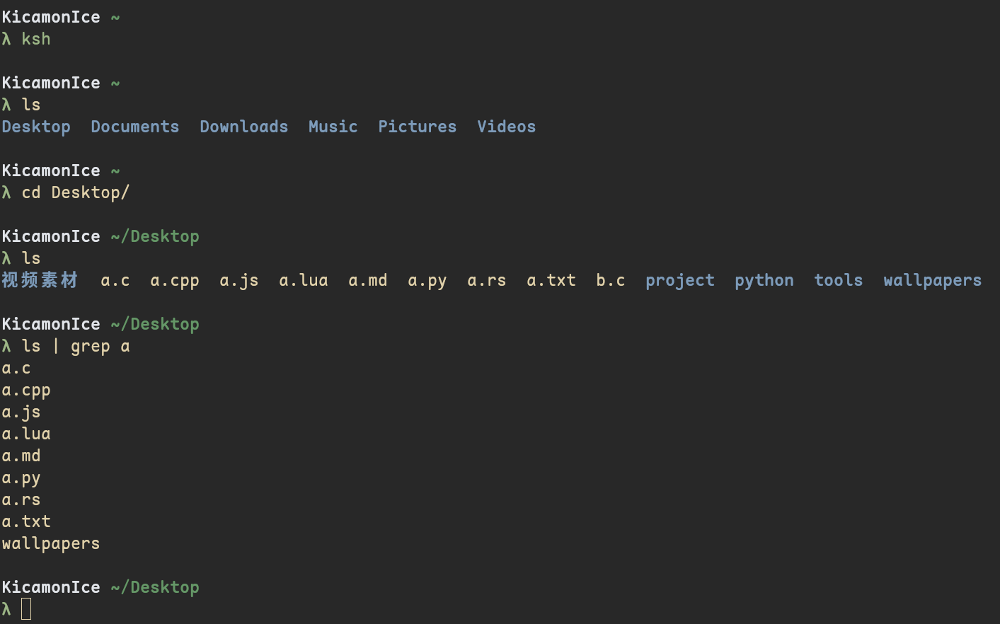

# A simple shell

这是一个由c语言实现的简易shell

### screenshot


### 主题配置
```shell
THEME_PREFIX_CHAR λ
THEME (white;none){hostname} (dark_green;none){directory} (purple;none){git_info}
THEME (green;none){prefix}
```

### TODO
- [x] 交互界面
- [x] TAB键补全
- [x] alias映射
- [x] 配置文件
- [x] 管道
- [x] 颜色
- [ ] 脚本词法分析
